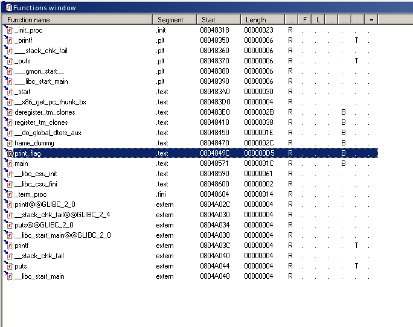

# hidden flag medium

## Description
n00b became depressed when 'Pro' found the flag in his binary in a matter of seconds. This time he hid the flag a little more securely. See if you can still find it: file[http://hack.bckdr.in/HIDE-MEDIUM/hide_medium]
Created by: Dhaval Kapil
No. of Correct Submissions: 429

## Solution

Get the file and verify it's type.
```
$ wget http://hack.bckdr.in/HIDE-MEDIUM/hide_medium
$ file hide_medium
hide_medium: ELF 32-bit LSB executable, Intel 80386, version 1 (SYSV), dynamically linked, interpreter /lib/ld-linux.so.2, for GNU/Linux 2.6.24, BuildID[sha1]=fe9ddc13d0659e1badb3fd04934d02b4aa60893a, not stripped
```

If we make the file executable and try to run it, it simply prints "It's not that easy as you think so". We can also look for other strings using the *strings* command, but I found nothing.

```
$ strings hide_medium
...
It's not that easy as you think so
...
```
Ok, lets take a closer look at the binary with IDA (IDA Pro has a freeware version you can use).
If we inspect the functions we can see that there exist a function called ``` print_flag()```


Lets try and call that function from gdb.

```
$ gdb hide_medium
$ gdb hide_medium

(gdb) disas main
Dump of assembler code for function main:
   0x08048571 <+0>:	push   %ebp
   0x08048572 <+1>:	mov    %esp,%ebp
   0x08048574 <+3>:	and    $0xfffffff0,%esp
   0x08048577 <+6>:	sub    $0x10,%esp
   0x0804857a <+9>:	movl   $0x8048664,(%esp)
   0x08048581 <+16>:	call   0x8048350 <printf@plt>
   0x08048586 <+21>:	mov    $0x0,%eax
   0x0804858b <+26>:	leave  
   0x0804858c <+27>:	ret    
End of assembler dump.
(gdb) break *0x08048581
Breakpoint 1 at 0x8048581
(gdb) run
Starting program: ...

Breakpoint 1, 0x08048581 in main ()
(gdb) call print_flag()
```
Out comes the flag :)
