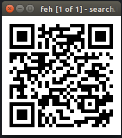

# search

## Description
A particular file came across our team of hackers. Some say the it gives the location of a flag. Download the file here[http://hack.bckdr.in/SEARCH/search.zip].
Created by: Dhaval Kapil
No. of Correct Submissions: 1167

## Solution
Download and unzip the file then verify it's file type.
```
$ wget http://hack.bckdr.in/SEARCH/search.zip

$ unzip search.zip
Archive:  search.zip
  inflating: search.txt   

$ file search.txt
search.txt: JPEG image data, JFIF standard 1.01, resolution (DPI), density 1x1, segment length 16, baseline, precision 8, 200x200, frames 1
```

Hmm, this does not look like a .txt file. Let's try and open it with an imageviewer.

```
$ feh searc.txt
```


This looks like a qr code.
We can try and decode the qr with *zbarimg*[http://manpages.ubuntu.com/manpages/xenial/man1/zbarimg.1.html].

```
$ zbarimg search.txt
QR-Code:<URL to flag>
scanned 1 barcode symbols from 1 images in 0 seconds
```

And there is our flag.
